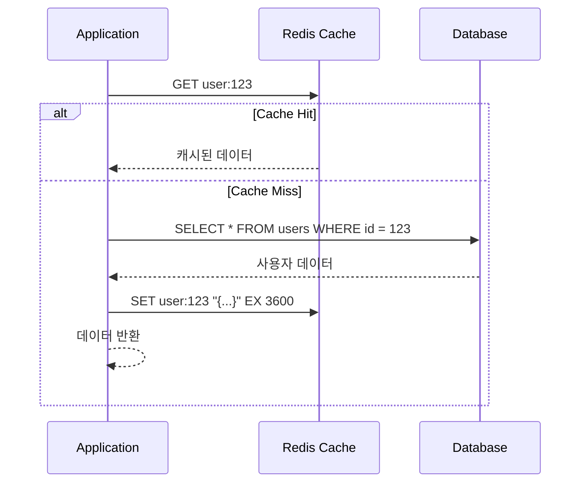
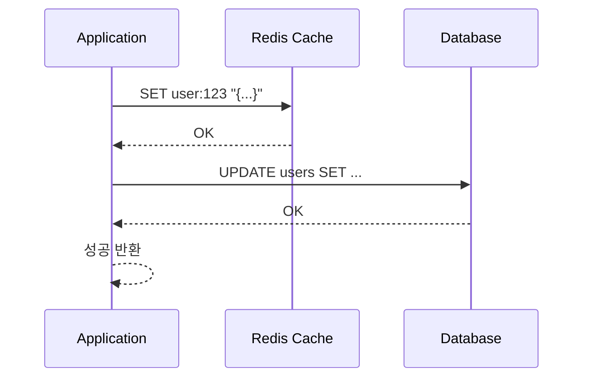
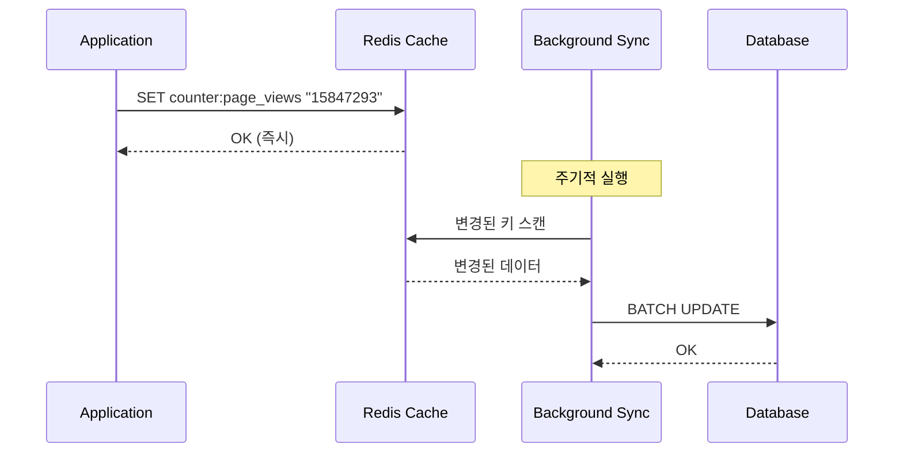
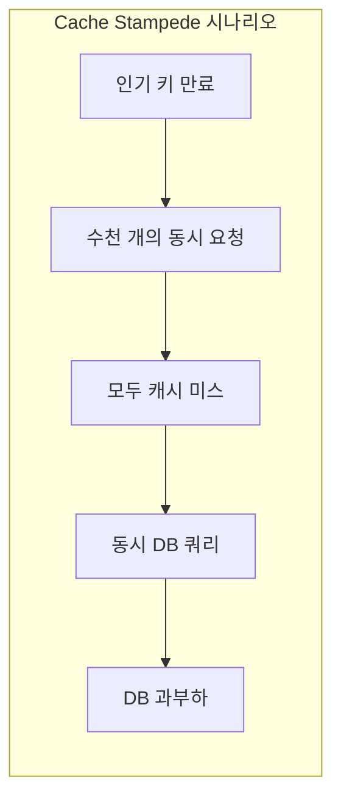
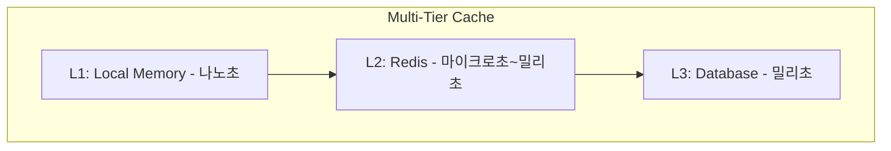

# Caching Patterns

캐싱은 Redis의 가장 일반적인 사용 사례입니다. 이 문서에서는 다양한 캐싱 패턴과 각각의 장단점, 사용 시나리오를 다룹니다.

---

## Cache-Aside Pattern (Lazy Loading)

> 읽기 중심 워크로드를 위한 지연 로딩 패턴

### 개념

애플리케이션이 캐시를 보조 데이터 저장소로 취급하여 명시적으로 관리합니다. 캐시 미스 시 데이터베이스에서 조회한 후 캐시에 저장합니다.

### 동작 방식

1. **캐시 먼저 확인**: Redis에서 요청한 키 조회
2. **캐시 히트 시**: 즉시 캐시된 데이터 반환
3. **캐시 미스 시**: 데이터베이스 조회 후 Redis에 저장 (TTL 설정), 데이터 반환



### Redis 명령어

```redis
# 캐시 조회
GET user:123

# 캐시 미스 시 데이터베이스 조회 후 저장
SET user:123 "{...user data...}" EX 3600
```

### 장점

- **캐시 장애에 대한 복원력**: Redis 장애 시 데이터베이스로 graceful degradation
- **메모리 효율성**: 실제로 요청된 데이터만 캐시됨
- **단순성**: 이해하고 구현하기 쉬움

### 단점

- **오래된 데이터 문제**: 데이터베이스 업데이트 후 캐시가 TTL 만료될 때까지 오래된 데이터 유지

### 오래된 데이터 완화

데이터베이스 업데이트 성공 시 해당 캐시 키 삭제:

```redis
DEL user:123
```

다음 읽기에서 캐시 미스가 발생하고 최신 데이터를 조회합니다.

### 사용 시기

- 읽기 중심 워크로드
- 잠시 오래된 데이터가 허용됨
- 캐시 장애 시 graceful degradation 필요
- 캐시할 데이터에 대한 세밀한 제어 필요

### 사용 피해야 할 때

- 캐시와 데이터베이스 간 강한 일관성 필요
- 쓰기 후 즉시 읽기 패턴이 빈번함
- 캐시 미스 비용이 극도로 높음

---

## Write-Through Caching Pattern

> 캐시-데이터베이스 강한 일관성 유지

### 개념

모든 쓰기 작업이 Redis와 데이터베이스 모두에 동기적으로 업데이트됩니다. 성공 확인 전 두 쓰기가 모두 완료되어야 합니다.

### 동작 방식

1. 애플리케이션이 Redis에 데이터 쓰기
2. 애플리케이션이 데이터베이스에 동일한 데이터 쓰기
3. 두 쓰기 모두 성공해야 작업 완료



### Redis 명령어

```redis
SET user:123 "{...updated user data...}"
# 이어서 데이터베이스 쓰기 수행
```

### 장점

- **강한 일관성**: 캐시가 항상 최신 데이터 반영
- **쓰기 후 빠른 읽기**: 쓴 데이터가 즉시 캐시에서 사용 가능
- **간단한 캐시 무효화**: 쓰기가 캐시를 통과하므로 별도 무효화 불필요

### 단점

- **쓰기 지연 증가**: 두 쓰기 모두 완료될 때까지 대기
- **캐시 오염**: 자주 읽히지 않는 데이터도 캐시 메모리 차지
- **부분 실패 복잡성**: 데이터베이스 쓰기 실패 시 불일치 발생 가능

### 부분 실패 처리

가장 안전한 접근: 데이터베이스 먼저 쓰기

1. 데이터베이스에 쓰기
2. 성공하면 캐시에 쓰기
3. 캐시 쓰기 실패 시 로그만 남기고 작업 실패 처리 안 함

### 사용 시기

- 캐시와 데이터베이스 간 강한 일관성 필요
- 쓰기 후 즉시 읽기 패턴이 빈번함
- 쓰기 지연 오버헤드가 수용 가능
- 데이터셋이 상대적으로 작음

---

## Write-Behind (Write-Back) Caching Pattern

> 최대 쓰기 처리량을 위한 비동기 동기화

### 개념

애플리케이션은 Redis에만 쓰고 즉시 확인받습니다. 별도의 백그라운드 프로세스가 주기적으로 변경 사항을 데이터베이스에 동기화합니다.

### 동작 방식

1. 애플리케이션이 Redis에 데이터 쓰기
2. Redis가 즉시 확인 (클라이언트는 성공 인식)
3. 백그라운드 프로세스가 주기적으로 변경된 데이터를 읽어 데이터베이스에 쓰기



### Redis 명령어

```redis
SET counter:page_views "15847293"
INCRBY counter:page_views 1
```

### 장점

- **매우 낮은 쓰기 지연**: Redis 확인 후 즉시 완료 (서브 밀리초)
- **높은 처리량**: 데이터베이스가 쓰기 폭주로부터 보호됨
- **쓰기 병합**: 동일 키에 대한 여러 업데이트가 단일 데이터베이스 쓰기로 병합됨

### 내구성 트레이드오프

- **데이터 손실 위험**: Redis가 동기화 전에 실패하면 마지막 동기화 이후 쓰기 손실
- **결과적 일관성**: 데이터베이스가 Redis보다 뒤처짐

### 데이터 손실 완화

- **Redis 지속성**: `appendfsync everysec`로 AOF 활성화 (1초 내 손실 제한)
- **짧은 동기화 간격**: 손실 윈도우 최소화
- **복제**: 복제본 실행으로 단일 노드 실패 대비

### 적합한 사용 사례

- **카운터 및 메트릭**: 페이지 뷰, 좋아요, 노출 수 (일부 손실 허용)
- **고빈도 세션 업데이트**: 빈번한 세션 터치
- **분석 수집**: 고속 원격 측정 데이터 수집
- **게임 리더보드**: 빠른 점수 업데이트

### 사용 금지 사례

- 금융 거래
- 주문 처리
- 사용자 자격 증명 또는 인증 데이터
- 규정 준수 요구 사항이 있는 데이터
- 데이터 손실이 용납되지 않는 모든 것

---

## Cache Stampede Prevention

> 캐시 스탬피드(Thundering Herd) 방지

### 문제 설명

인기 있는 캐시 키가 만료되면 수천 개의 동시 요청이 동시에 데이터베이스를 쿼리하여 값을 재생성합니다.



### 해결책 1: 확률적 조기 만료 (X-Fetch)

물리적 TTL을 필요보다 길게 설정하고, 만료에 가까워질수록 새로고침 확률이 증가합니다.

#### 알고리즘

```
refresh_decision = current_time - (expiry_time - delta * beta * log(random()))
```

- `delta`: 값 재생성에 필요한 시간
- `beta`: 튜닝 매개변수 (일반적으로 1.0)
- `random()`: 0과 1 사이의 무작위 값

#### 결과

만료 시점에 수천 개의 동시 쿼리 대신, 단일 요청이 만료 직전에 캐시를 새로고침하고 나머지는 약간 오래된 데이터를 계속 제공합니다.

### 해결책 2: 뮤텍스 락킹

하나의 프로세스만 캐시 재생성을 허용하는 결정론적 접근입니다.

#### 동작 방식

1. `SET lock:mykey <token> NX PX 5000`로 락 획득 시도
2. 락 획득 시 데이터베이스 쿼리 및 캐시 업데이트
3. 다른 요청은 대기하거나 오래된/기본값 반환
4. 캐시 채워진 후 락 해제

#### Redis 명령어

```redis
# 락 획득
SET lock:popular_key abc123 NX PX 5000
```

#### 안전한 락 해제 (Lua 스크립트)

```lua
if redis.call("get", KEYS[1]) == ARGV[1] then
    return redis.call("del", KEYS[1])
end
return 0
```

#### 대기 클라이언트 처리 옵션

- **폴링**: 잠시 대기 후 캐시 다시 확인
- **오래된 데이터 반환**: 오래된 복사본이 있으면 제공
- **기본값 반환**: 기본 또는 저하된 응답 제공
- **빠른 실패**: 즉시 오류 반환

### 비교

| 접근 방식 | 복잡성 | DB 쿼리 | 오래된 데이터 |
|----------|--------|---------|--------------|
| 보호 없음 | 낮음 | N (요청당 1개) | 없음 |
| X-Fetch | 중간 | 1-2 | 짧은 윈도우 |
| 뮤텍스 락 | 높음 | 정확히 1 | 없음 |

### 권장사항

대부분의 애플리케이션에서는 뮤텍스 락킹으로 시작하는 것이 좋습니다. 이해하기 쉽고 강력한 보호를 제공합니다. 초고트래픽 키에서는 짧은 락 경쟁도 문제가 될 수 있으므로 X-Fetch를 고려하세요.

---

## Server-Assisted Client-Side Caching

> 네트워크 RTT 제거를 위한 서버 지원 클라이언트 사이드 캐싱

### 개념

자주 액세스하는 키를 애플리케이션 메모리에 캐시하고, Redis 6+가 데이터 변경 시 자동으로 무효화 메시지를 보냅니다.

### 아키텍처



### 추적 모드

#### Default Tracking

서버가 각 클라이언트가 요청한 키를 기억합니다. 키가 수정되면 무효화 메시지를 보냅니다.

```redis
CLIENT TRACKING ON
```

**트레이드오프**: 서버가 키→클라이언트ID 매핑 테이블 유지 필요

#### Broadcasting Mode

개별 키 액세스 대신 키 프리픽스를 구독합니다.

```redis
CLIENT TRACKING ON BCAST PREFIX user: PREFIX session:
```

**트레이드오프**: 실제 캐시하지 않은 키에 대한 무효화 메시지도 수신할 수 있음

### Redis 명령어

```redis
# 기본 추적 활성화
CLIENT TRACKING ON

# 브로드캐스트 모드
CLIENT TRACKING ON BCAST PREFIX user:

# 무효화 리다이렉트
CLIENT TRACKING ON REDIRECT 123

# 추적 비활성화
CLIENT TRACKING OFF

# 자신의 수정에 대한 무효화 방지
CLIENT TRACKING ON NOLOOP
```

### OPTIN/OPTOUT 옵션

```redis
CLIENT TRACKING ON OPTIN

CLIENT CACHING YES
GET user:123  # 이 키만 추적됨

CLIENT CACHING NO
GET temp:data  # 이 키는 추적되지 않음
```

### 사용 시기

- 초고처리량 애플리케이션에서 네트워크 RTT가 중요한 경우
- 자주 액세스하는 "hot" 키
- 상대적으로 안정적인 데이터의 읽기 중심 워크로드
- 이미 로컬 캐시를 유지 중이고 무효화가 필요한 경우

### 고려사항

- **메모리 관리**: 애플리케이션이 로컬 캐시 크기 관리 필요
- **복잡성**: 무효화 메시지 처리를 위한 전용 연결 관리 필요
- **휘발성 데이터에 부적합**: 데이터가 지속적으로 변경되면 무효화 트래픽이 이득을 초과
- **RESP3 권장**: Redis 6+ RESP3 프로토콜 사용 권장
