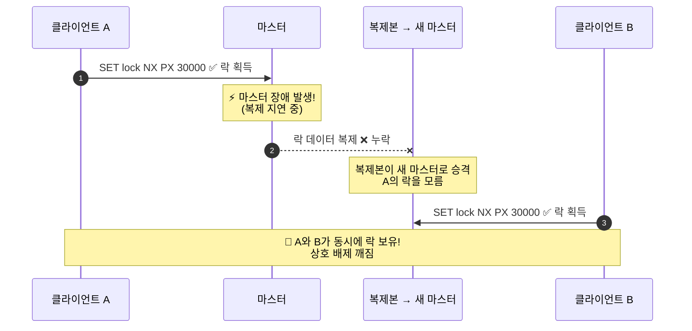
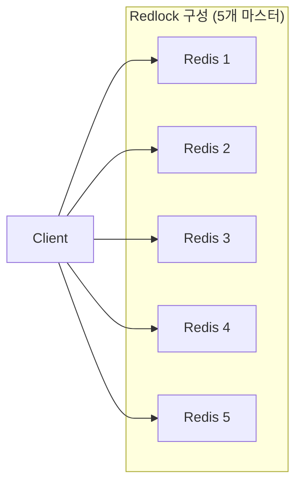
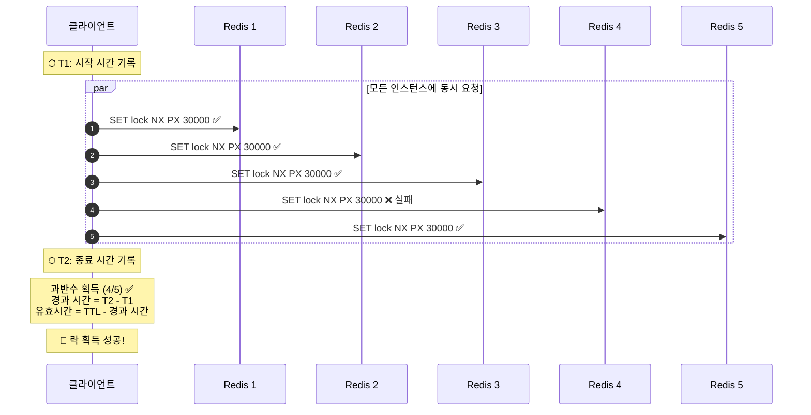
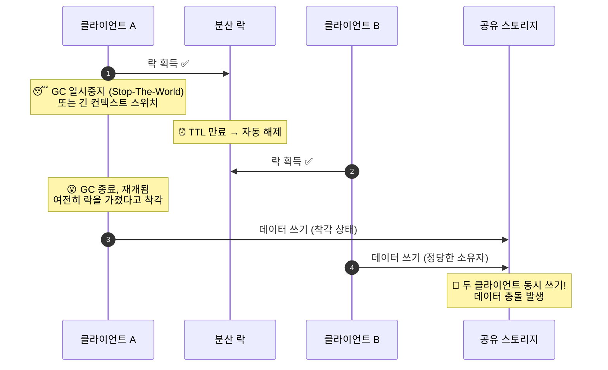
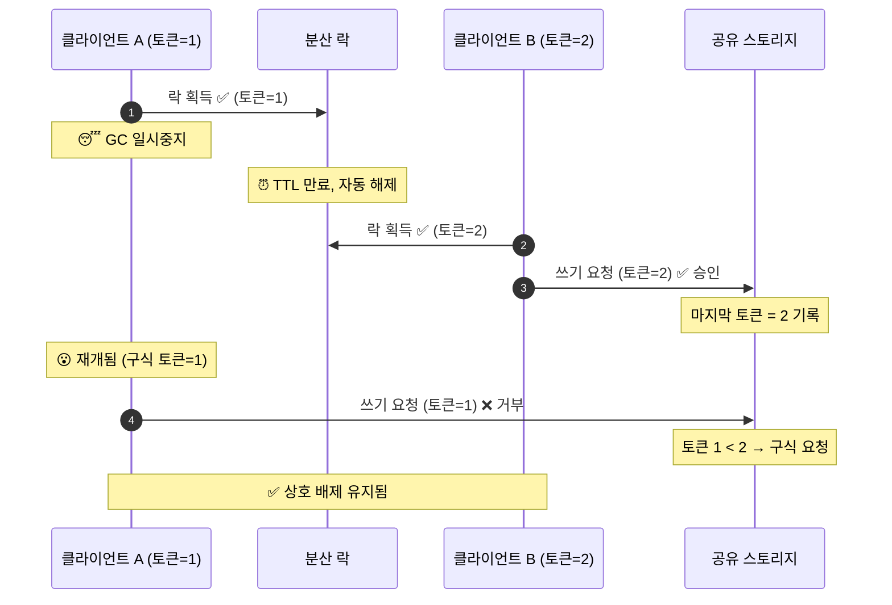

# Distributed Locking Patterns

분산 시스템에서 상호 배제(Mutual Exclusion)를 구현하기 위한 Redis 패턴입니다.

---

## Distributed Locking with Redis

> 분산 프로세스 간 뮤추얼 익스클루전 구현

### 기본 락

Redis 락은 SET 명령어의 특수 옵션을 사용합니다:

```redis
SET resource:lock <unique_token> NX PX 30000
```

- **NX (Not Exists)**: 키가 존재하지 않을 때만 설정 → 하나의 클라이언트만 락 획득
- **PX (Expiration)**: 30초 후 자동 만료 → 교착 상태 방지
- **Token**: 락 소유자 식별을 위한 고유 값 (UUID 권장)

### 옵션의 중요성

| 옵션 | 목적 |
|------|------|
| NX | 동시에 하나의 클라이언트만 락 획득 보장 |
| PX | 클라이언트 장애 시 자동 락 해제 |
| Token | 안전한 락 해제를 위한 소유자 식별 |

### 안전한 락 해제

절대 단순 DEL로 해제하지 마세요:

```redis
# 위험한 방법!
DEL resource:lock
```

**위험 시나리오:**
1. 클라이언트 A가 토큰 "abc"로 락 획득
2. 클라이언트 A가 너무 오래 걸려 락 만료
3. 클라이언트 B가 토큰 "xyz"로 락 획득
4. 클라이언트 A가 완료되어 DEL 호출
5. 클라이언트 A가 클라이언트 B의 락을 삭제!

### 올바른 락 해제 (Lua 스크립트)

```lua
if redis.call("get", KEYS[1]) == ARGV[1] then
    return redis.call("del", KEYS[1])
else
    return 0
end
```

```redis
EVAL <script> 1 resource:lock <unique_token>
```

### 락 연장 (Lock Extension)

작업이 예상보다 오래 걸릴 경우:

```lua
if redis.call("get", KEYS[1]) == ARGV[1] then
    return redis.call("pexpire", KEYS[1], ARGV[2])
else
    return 0
end
```

### 사용 시나리오

- **리더 선출**: 분산 시스템에서 리더 선택
- **작업 중복 방지**: 동일 작업의 동시 실행 방지
- **리소스 보호**: 공유 리소스에 대한 동시 액세스 제어
- **속도 제한**: 분산 속도 제한 구현

### 주의사항

- 락 TTL은 예상 작업 시간보다 충분히 길게 설정
- 토큰은 반드시 고유한 값 사용 (UUID 등)
- 락 획득 실패 시 적절한 재시도 로직 구현

---

## The Redlock Algorithm

> 장애 허용 분산 락 알고리즘

### 단일 인스턴스 락의 문제

마스터-복제본 설정에서 장애 조치 후 두 클라이언트가 동일한 락을 보유할 수 있습니다:

1. 클라이언트 A가 마스터에서 락 획득
2. 마스터가 복제본에 쓰기를 복제하기 전에 장애
3. 복제본이 마스터로 승격
4. 클라이언트 B가 동일한 락 획득 (복제본은 A의 락을 모름)



> **핵심 문제**: 마스터-복제본 비동기 복제는 데이터 정합성을 보장하지 않습니다. 복제가 완료되기 전 마스터가 죽으면, 승격된 복제본은 이전 락 상태를 모릅니다.

### Redlock 해결책

N개의 독립적인 Redis 마스터(일반적으로 5개)를 사용합니다. 락은 과반수(N/2 + 1) 이상의 인스턴스에서 획득되어야 합니다.



5개의 **독립된** Redis 마스터에 락 획득을 시도하고, 과반수(3/5) 이상에서 성공하면 락을 획득한 것으로 간주합니다. 하나가 장애 나도 나머지로 진실을 알 수 있습니다.



> R4가 실패했지만 과반수(3개 이상) 획득했으므로 락은 성공입니다. 실제 유효 시간은 네트워크 지연(경과 시간)을 차감한 값입니다.

### 락 획득 알고리즘

1. 현재 시간 밀리초 단위로 획득 (T1)
2. 모든 N개 인스턴스에 순차적 또는 병렬로 락 획득 시도:
   ```redis
   SET resource_name <random_value> NX PX 30000
   ```
3. 현재 시간 다시 획득 (T2)
4. 경과 시간 계산: `elapsed = T2 - T1`
5. 락 획득 성공 조건:
   - N/2 + 1 이상의 인스턴스에서 락 획득
   - 경과 시간이 TTL 미만
6. 실제 락 유효 시간:
   ```
   validity_time = TTL - elapsed - clock_drift_allowance
   ```
7. 락 획득 실패 시 모든 인스턴스에서 즉시 락 해제

### 락 해제

모든 인스턴스에서 Lua 스크립트로 해제:

```lua
if redis.call("get", KEYS[1]) == ARGV[1] then
    return redis.call("del", KEYS[1])
else
    return 0
end
```

### 안전성 및 활동성 속성

| 속성 | 설명 |
|------|------|
| 상호 배제 | 어느 시점에도 최대 하나의 클라이언트만 락 보유 |
| 교착 상태 방지 | 클라이언트 장애 시 TTL로 자동 해제 |
| 장애 허용 | 과반수 인스턴스 사용 가능 시 락 획득/해제 가능 |

### 펜싱 문제 (The Fencing Problem)

자동 만료가 있는 모든 분산 락의 미묘한 문제:

1. 클라이언트 A가 락 획득
2. 클라이언트 A가 일시 중지 (GC, 컨텍스트 스위치 등)
3. 락 만료
4. 클라이언트 B가 락 획득
5. 클라이언트 A가 재개되어 여전히 락을 보유한다고 착각
6. 두 클라이언트가 공유 리소스에서 동시 작업



> **왜 위험한가?** 락 만료는 클라이언트가 모르는 사이 일어납니다. A는 자신이 여전히 락을 가지고 있다고 믿고 쓰기를 수행하지만, 실제로는 B가 정당한 소유자입니다. 이 문제는 Redlock뿐 아니라 **TTL 기반 모든 분산 락**의 근본적 한계입니다.

#### 펜싱 토큰 해결책

1. 락 획득 시 단조 증가 토큰도 함께 획득
2. 공유 리소스 액세스 시 토큰 포함
3. 리소스는 가장 높은 토큰보다 오래된 토큰의 작업 거부



> **펜싱 토큰이 작동하려면** 공유 스토리지(DB 등)가 토큰을 검사할 수 있어야 합니다. Redis만으로는 불가능하고, 쓰기 대상 시스템이 협조해야 합니다. Martin Kleppmann이 이 문제를 명확히 지적한 바 있습니다.

### 사용 시기

**적합한 경우:**
- 동시성 제어가 없는 외부 리소스 조정
- 분산 작업 큐에서 중복 작업 방지
- 근사 정확성이 수용 가능한 분산 속도 제한
- 애플리케이션 인스턴스 간 리더 선출

**대안 고려:**
- 절대 정확성 보장 필요 시 (etcd, ZooKeeper 사용)
- 선형화 가능한 스토리지 시스템에서 펜싱 구현 가능 시
- 단일 인스턴스 Redis 신뢰성으로 충분한 경우

### 구현 가이드라인

| 항목 | 권장값 |
|------|--------|
| 인스턴스 수 | 5개 (최대 2개 장애 허용) |
| 인스턴스 독립성 | 복제 없음, 클러스터링 없음, 다른 AZ 권장 |
| TTL | 예상 작업 시간보다 훨씬 길게 (10-30초) |
| 인스턴스당 타임아웃 | 5-50ms |
| 랜덤 값 | 최소 20바이트, 암호학적으로 안전한 난수 |
| 클럭 드리프트 허용치 | 유효 시간의 1-2% 차감 |

### 단일 인스턴스 vs Redlock 비교

| 측면 | 단일 인스턴스 | Redlock |
|------|--------------|---------|
| 장애 허용 | 없음 | 소수 장애 허용 |
| 복잡성 | 낮음 | 높음 (5개 인스턴스) |
| 일관성 | 장애 조치 시 손실 | 과반수 생존 시 유지 |
| 사용 사례 | 비중요 조정 | 중요한 분산 조정 |

---

## Atomic Update Patterns

> WATCH/MULTI/EXEC, Lua 스크립트를 활용한 원자적 갱신 패턴

### 패턴 1: WATCH를 이용한 낙관적 락킹

WATCH는 check-and-set(CAS) 의미를 구현합니다. EXEC 전에 감시된 키가 변경되면 트랜잭션이 중단됩니다.

#### 기본 WATCH 패턴

```redis
WATCH account:123:balance
balance = GET account:123:balance
new_balance = balance - 100
MULTI
SET account:123:balance new_balance
EXEC
```

#### 재시도 루프

```python
max_retries = 5
for attempt in range(max_retries):
    WATCH account:123:balance
    balance = GET account:123:balance
    if balance < amount:
        UNWATCH
        raise InsufficientFunds()
    new_balance = balance - amount
    result = MULTI
    SET account:123:balance new_balance
    EXEC
    if result is not None:
        return  # 성공
# 재시도 초과
raise TooManyRetries()
```

#### 멀티 키 WATCH

```redis
WATCH inventory:sku123 order:456:status
stock = GET inventory:sku123
if stock < quantity:
    UNWATCH
    raise OutOfStock()
MULTI
DECRBY inventory:sku123 quantity
SET order:456:status "confirmed"
EXEC
```

> **Cluster 주의**: 모든 감시 키는 동일한 슬롯에 있어야 함. 해시 태그 사용: `inventory:{sku123}`, `order:{sku123}:456`

### 패턴 2: Lua 스크립트를 이용한 원자적 로직

Lua 스크립트는 실행 중 다른 명령어가 끼어들 수 없습니다.

#### Compare-and-Set

```lua
-- CAS: 현재 값이 예상과 일치할 때만 설정
if redis.call('GET', KEYS[1]) == ARGV[1] then
    redis.call('SET', KEYS[1], ARGV[2])
    return 1
end
return 0
```

```redis
EVAL <script> 1 mykey old_value new_value
```

#### 조건부 증가

```lua
local current = redis.call('GET', KEYS[1])
if current and tonumber(current) >= tonumber(ARGV[1]) then
    return redis.call('DECRBY', KEYS[1], ARGV[1])
end
return -1  -- 실패
```

#### 이체 작업

```lua
local from_balance = redis.call('GET', KEYS[1])
local to_balance = redis.call('GET', KEYS[2])
local amount = tonumber(ARGV[1])

if not from_balance or tonumber(from_balance) < amount then
    return {err = "Insufficient funds"}
end

redis.call('DECRBY', KEYS[1], amount)
redis.call('INCRBY', KEYS[2], amount)
return {ok = "Transfer complete"}
```

### 패턴 3: 섀도 키 패턴

대량 업데이트를 안전하게 수행하는 방법입니다.

1. 새 데이터를 임시 키에 작성
2. RENAME으로 원자적 교체

```redis
# 새 데이터 준비
HSET user:123:new name "Alice" email "alice@example.com"

# 원자적 교체
RENAME user:123:new user:123
```

### WATCH vs Lua 스크립트 비교

| 측면 | WATCH/MULTI/EXEC | Lua 스크립트 |
|------|------------------|--------------|
| 복잡한 로직 | 클라이언트에서 처리 | 서버에서 처리 |
| 네트워크 왕복 | 여러 번 | 1회 |
| 재시도 필요 | 예 | 아니오 |
| 디버깅 | 쉬움 | 어려움 |
| 슬롯 제약 | 같은 슬롯 필요 | 같은 슬롯 필요 |

### 사용 시나리오

- **계좌 이체**: 잔액 확인 후 원자적 차감/증가
- **재고 관리**: 재고 확인 후 주문 확정
- **카운터 업데이트**: 조건부 증가/감소
- **설정 업데이트**: 다중 필드 원자적 갱신
