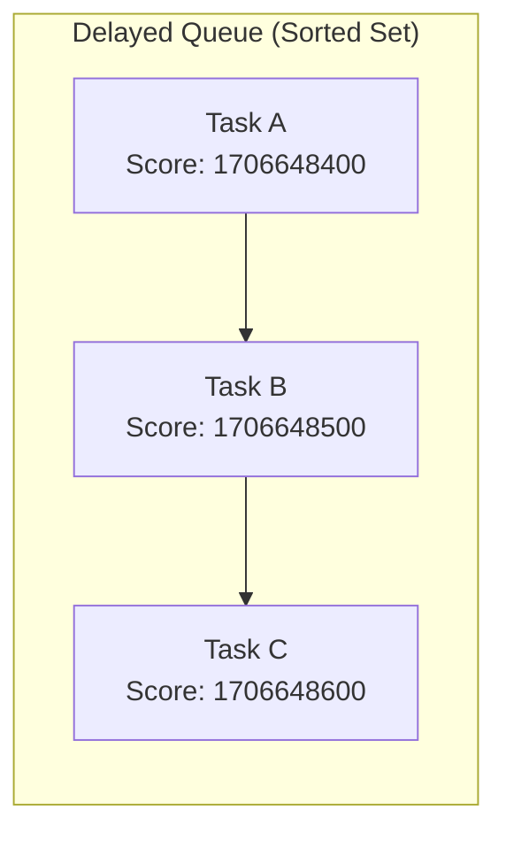
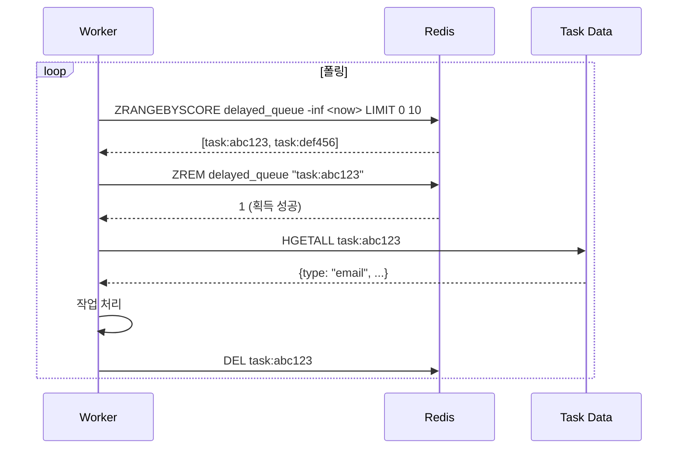
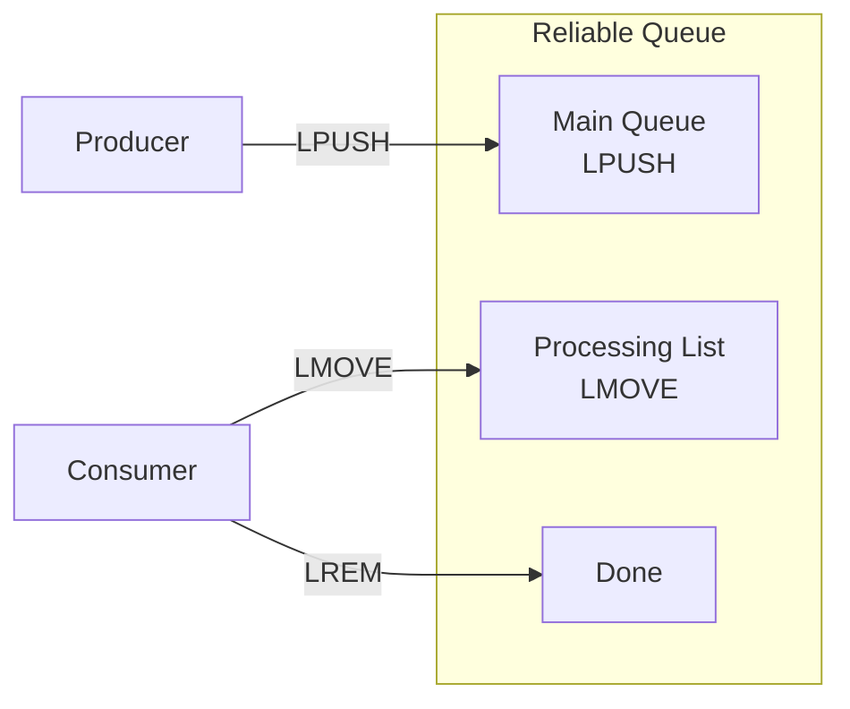
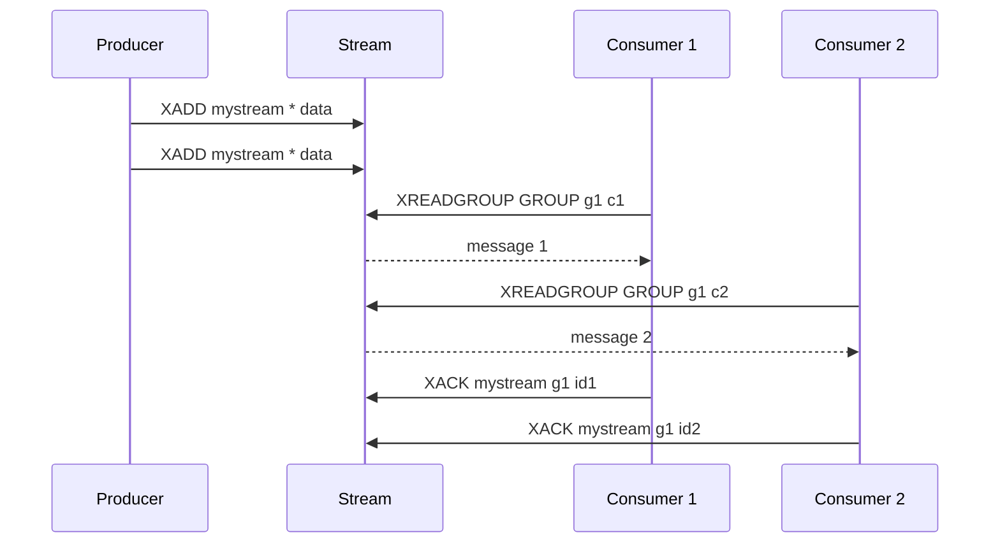
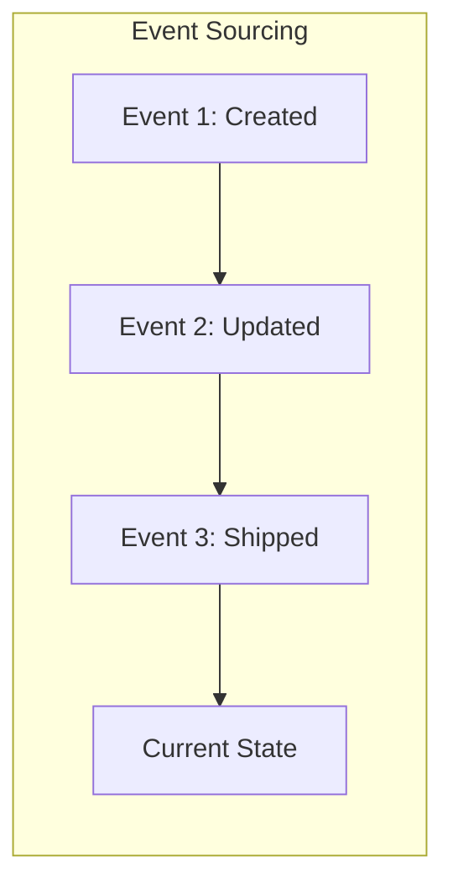
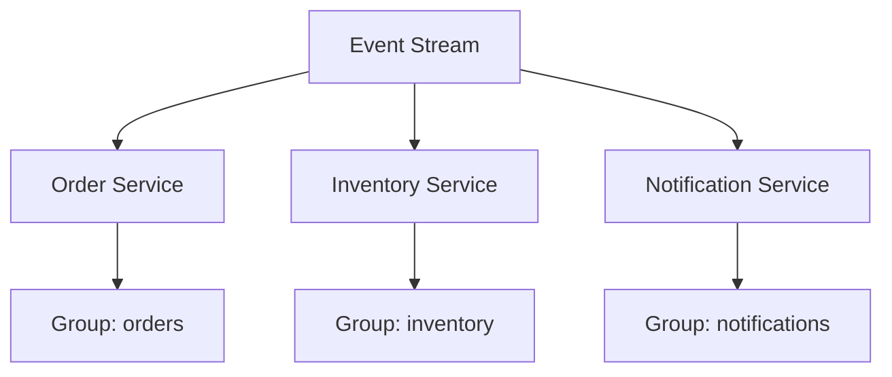

# Queue Patterns

Redis를 활용한 메시지 큐 및 작업 처리 패턴입니다.

---

## Delayed Queue Pattern

> Sorted Set을 활용한 지연 작업 실행

### 개념

Redis Lists는 FIFO 순서로 즉시 메시지를 처리하지만 지연 전달을 지원하지 않습니다. Sorted Set은 점수(Score)로 Unix 타임스탬프를 사용하여 시간 기반 정렬과 효율적인 범위 쿼리를 제공합니다.

### 데이터 모델



- **Member**: 작업 식별자 또는 페이로드
- **Score**: 작업 실행 시점의 Unix 타임스탬프

### 작업 스케줄링

5분 후 실행할 작업 예약:

```redis
ZADD delayed_queue 1706649000 "task:abc123"
```

작업 상세 정보는 별도 저장:

```redis
HSET task:abc123 type "send_email" recipient "user@example.com"
ZADD delayed_queue 1706649000 "task:abc123"
```

### 준비된 작업 폴링

실행 시간이 지난 작업 조회:

```redis
ZRANGEBYSCORE delayed_queue -inf 1706648500 LIMIT 0 10
```

- `-inf`: 하한 없음
- `1706648500`: 현재 시간
- `LIMIT 0 10`: 최대 10개

### 작업 원자적 획득

여러 워커가 동시에 폴링할 수 있으므로 중복 처리 방지를 위해 ZREM으로 원자적 획득:

```redis
ZREM delayed_queue "task:abc123"
```

- 반환값 1: 이 워커가 획득 (처리 진행)
- 반환값 0: 이미 다른 워커가 획득 (스킵)

### 전체 흐름



### 바쁜 대기 피하기

빈 큐를 계속 폴링하면 CPU 낭비입니다. 다음 작업 예정 시간을 확인:

```redis
ZRANGE delayed_queue 0 0 WITHSCORES
```

가장 빠른 작업과 예정 시간을 반환합니다. 준비된 작업이 없으면 해당 시간까지 대기합니다.

### Lua 스크립트로 원자적 폴링

```lua
local tasks = redis.call('ZRANGEBYSCORE', KEYS[1], '-inf', ARGV[1], 'LIMIT', 0, ARGV[2])
for i, task in ipairs(tasks) do
    redis.call('ZREM', KEYS[1], task)
end
return tasks
```

```redis
EVAL <script> 1 delayed_queue <current_timestamp> 10
```

### 재시도와 백오프

작업 실패 시 지연 후 재스케줄:

```redis
ZADD delayed_queue 1706649060 "task:abc123"
```

60초 후 재시도 예약. 작업 데이터에 재시도 횟수를 추적하여 지수 백오프 구현.

### 사용 사례

- **예약 이메일**: 특정 시간에 발송
- **알림 시스템**: 지연 후 사용자 알림
- **재시도 메커니즘**: 백오프로 실패 작업 재시도
- **속도 제한**: API 호출 시간 분산
- **지연 처리**: 비피크 시간에 작업 처리

### Streams와의 비교

| 측면 | Sorted Set | Streams |
|------|-----------|---------|
| 지연 실행 | 네이티브 지원 | 별도 구현 필요 |
| 소비자 그룹 | 미지원 | 지원 |
| 메시지 확인 | 미지원 | 지원 (XACK) |
| 복잡한 큐 요구 | 제한적 | 풍부한 기능 |

---

## Reliable Queue Pattern

> LMOVE를 활용한 신뢰성 있는 메시지 전달

### 개념

최소 한 번(at-least-once) 메시지 전달을 보장합니다. LMOVE(또는 RPOPLPUSH)를 사용하여 메시지를 처리 리스트로 원자적 이동시킵니다.

### 아키텍처



### 기본 패턴

```redis
# 메시지 생성
LPUSH myqueue "message:001"

# 메시지 소비 (처리 리스트로 이동)
LMOVE myqueue processing RIGHT LEFT
```

### 안전한 메시지 처리

1. **LMOVE**: 메시지를 메인 큐에서 처리 리스트로 이동
2. **처리**: 메시지 처리
3. **LREM**: 처리 완료 후 처리 리스트에서 제거

```redis
# 1. 메시지 획득 및 이동
LMOVE myqueue processing RIGHT LEFT

# 2. 메시지 처리 (애플리케이션 로직)

# 3. 처리 완료 후 제거
LREM processing 1 "message:001"
```

### 장애 복구

소비자가 크래시하면 처리 리스트에 메시지가 남습니다. 재시작 시:

1. 처리 리스트 검사
2. 오래된 메시지 식별 (타임아웃)
3. 메인 큐로 재이동 또는 재처리

```lua
-- 타임아웃된 메시지 재큐잉
local items = redis.call('LRANGE', KEYS[1], 0, -1)
for i, item in ipairs(items) do
    local data = cjson.decode(item)
    if data.timestamp < tonumber(ARGV[1]) then
        redis.call('LREM', KEYS[1], 1, item)
        redis.call('LPUSH', KEYS[2], item)
    end
end
```

### BRPOPLPUSH (블로킹 버전)

```redis
BRPOPLPUSH myqueue processing 30
```

30초 동안 대기하며 메시지가 들어오면 즉시 반환합니다.

### 사용 시나리오

- **작업 큐**: 백그라운드 작업 처리
- **이메일 발송**: 신뢰성 있는 이메일 큐
- **주문 처리**: 주문 워크플로우
- **로그 처리**: 로그 집계 파이프라인

---

## Streams Consumer Group Patterns

> 소비자 그룹 기반 신뢰성 있는 메시지 처리

### 기본 개념

Redis Streams의 소비자 그룹은 여러 소비자에게 메시지를 분배하고 처리 실패 시 복구를 지원합니다.

### 기본 명령어

```redis
# 스트림 생성 및 메시지 추가
XADD mystream * field1 value1

# 소비자 그룹 생성
XGROUP CREATE mystream mygroup $ MKSTREAM

# 메시지 읽기
XREADGROUP GROUP mygroup consumer1 COUNT 1 BLOCK 2000 STREAMS mystream >

# 메시지 확인 (ACK)
XACK mystream mygroup <message_id>

# 보류 메시지 확인
XPENDING mystream mygroup
```

### 메시지 흐름



### 실패 복구 패턴

#### 1. 보류 메시지 확인

```redis
XPENDING mystream mygroup - + 10
```

반환값: 메시지 ID, 소비자 이름, 유휴 시간, 전달 횟수

#### 2. 메시지 클레임 (XCLAIM)

다른 소비자가 처리하지 못한 메시지를 가져옵니다:

```redis
XCLAIM mystream mygroup consumer2 60000 <message_id>
```

- 60000: 60초 이상 유휴 상태인 메시지

#### 3. 자동 재할당 (XAUTOCLAIM)

```redis
XAUTOCLAIM mystream mygroup consumer2 60000 - COUNT 10
```

#### 4. 포이즌 필 (Poison Pills) 처리

계속 실패하는 메시지 처리:

```lua
-- 전달 횟수가 임계값 초과 시 DLQ로 이동
local pending = redis.call('XPENDING', KEYS[1], KEYS[2], ARGV[1], ARGV[2], 1)
if pending[1] and pending[1][4] > 5 then  -- 5회 초과
    local msg = redis.call('XRANGE', KEYS[1], pending[1][1], pending[1][1])
    redis.call('XADD', 'dlq:' .. KEYS[1], '*', 'payload', msg[1][2])
    redis.call('XACK', KEYS[1], KEYS[2], pending[1][1])
end
```

### 메모리 관리

#### XTRIM

스트림 길이 제한:

```redis
XADD mystream MAXLEN ~ 10000 * field value
```

- `~`: 정확하지 않아도 됨 (성능 최적화)
- `10000`: 최대 항목 수

#### XDEL

특정 메시지 삭제:

```redis
XDEL mystream <message_id>
```

### 소비자 관리

```redis
# 소비자 삭제
XGROUP DELCONSUMER mystream mygroup consumer1

# 그룹 삭제
XGROUP DESTROY mystream mygroup
```

### 사용 시나리오

- **이벤트 소싱**: 이벤트 로그 처리
- **작업 분배**: 여러 워커에 작업 분배
- **실시간 처리**: 실시간 데이터 스트림 처리
- **CDC (Change Data Capture)**: 데이터 변경 스트림

---

## Redis Streams and Event Sourcing

> 이벤트 소싱 구현을 위한 Redis Streams 활용

### 이벤트 소싱 개념

상태를 직접 저장하지 않고 상태를 변경한 이벤트의 시퀀스를 저장합니다.



### Redis Streams 구조

```redis
# 주문 이벤트 스트림
XADD orders:events * type "order_created" orderId "123" userId "456" total "99.99"
XADD orders:events * type "payment_received" orderId "123" amount "99.99"
XADD orders:events * type "order_shipped" orderId "123" trackingId "TRK-001"
```

### 이벤트 재생 (Replay)

```redis
# 모든 이벤트 조회
XRANGE orders:events - +

# 특정 시점 이후 이벤트
XRANGE orders:events 1706648400000-0 +
```

### 스냅샷 패턴

전체 이벤트 재생 비용을 줄이기 위해 주기적 스냅샷:

```redis
# 스냅샷 저장
SET order:123:snapshot '{...current state...}'
SET order:123:snapshot:version "1706648400000-0"

# 스냅샷 이후 이벤트만 재생
XRANGE orders:events (1706648400000-0 +
```

### 멀티 소비자 이벤트 처리

여러 서비스가 동일한 이벤트 스트림을 독립적으로 처리:



### 장점

1. **완전한 감사 추적**: 모든 변경 이력 보존
2. **시점 복구**: 특정 시점 상태로 재구성 가능
3. **이벤트 재생**: 버그 수정 후 이벤트 재처리
4. **분리된 처리**: 여러 서비스가 독립적으로 이벤트 소비

### 주의사항

1. **이벤트 불변성**: 이벤트는 절대 수정/삭제하지 않음
2. **스키마 진화**: 이벤트 스키마 변경 시 하위 호환성 고려
3. **스토리지 관리**: XTRIM으로 스트림 크기 관리
4. **멱등성**: 이벤트 핸들러는 멱등성 보장
