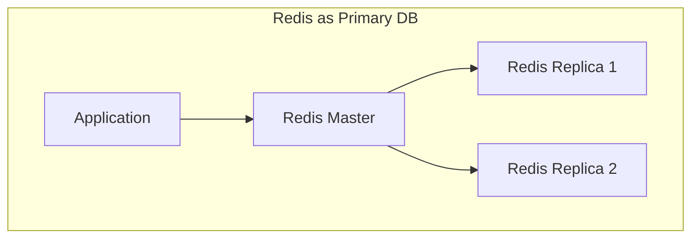

# Advanced Patterns

확장성과 특수 용도를 위한 고급 Redis 패턴입니다.

---

## Hash Tag Co-location Patterns

> Redis Cluster에서 키 배치 제어

### 개념

Redis Cluster는 키 이름의 해시를 기반으로 키를 슬롯에 분배합니다. 해시 태그 `{...}`를 사용하여 키의 어느 부분이 슬롯을 결정할지 제어할 수 있습니다.

### 동작 방식

```redis
# 해시 태그 없이 - 각각 다른 슬롯
user:123:profile → 슬롯 A
user:123:settings → 슬롯 B

# 해시 태그 사용 - 동일 슬롯
user:{123}:profile → "123" 해시 → 슬롯 X
user:{123}:settings → "123" 해시 → 슬롯 X
user:{123}:sessions → "123" 해시 → 슬롯 X
```

### 기본 패턴: 사용자 데이터 코로케이션

```redis
user:{user_id}:profile
user:{user_id}:settings
user:{user_id}:notifications
user:{user_id}:sessions
```

이제 다음이 가능합니다:
- MULTI/EXEC로 여러 필드 원자적 업데이트
- 모든 사용자 키에 접근하는 Lua 스크립트 실행
- WATCH로 여러 키에 대한 낙관적 락킹

### 원자적 멀티 키 작업

#### 관련 키 간 트랜잭션

```redis
MULTI
HSET user:{123}:profile name "Alice" updated_at "1706648400"
HSET user:{123}:settings theme "dark"
INCR user:{123}:stats:updates
EXEC
```

모든 명령이 동일한 슬롯에 있어 원자적 실행됩니다.

#### 여러 키에 걸친 Lua 스크립트

```lua
local profile = redis.call('HGETALL', KEYS[1])
local settings = redis.call('HGETALL', KEYS[2])
-- 두 데이터 원자적 처리
redis.call('SET', KEYS[3], cjson.encode({profile, settings}))
return 'OK'
```

```redis
EVAL <script> 3 user:{123}:profile user:{123}:settings user:{123}:combined
```

### 주문 처리 예시

```redis
# 주문 관련 데이터 코로케이션
order:{order_id}:header
order:{order_id}:items
order:{order_id}:status
order:{order_id}:payments

# 원자적 주문 상태 업데이트
MULTI
HSET order:{123}:header status "confirmed"
HSET order:{123}:status current "confirmed" updated_at "1706648400"
INCR order:{123}:stats:updates
EXEC
```

### 쇼핑 카트 예시

```redis
# 카트 아이템 코로케이션
cart:{session_id}:items
cart:{session_id}:metadata
cart:{session_id}:coupons

# Lua 스크립트로 카트 총액 계산
local items = redis.call('HGETALL', KEYS[1])
local coupons = redis.call('SMEMBERS', KEYS[2])
-- 총액 계산 로직
return total
```

### 주의사항

1. **데이터 핫스팟**: 모든 관련 키가 동일한 슬롯에 있으므로 한 노드에 부하 집중 가능
2. **밸런싱 고려**: 매우 큰 엔티티는 별도 키로 분리 고려
3. **키 네이밍 일관성**: 해시 태그 위치를 일관되게 유지

### 언제 사용할까?

**적합한 경우:**
- 같은 엔티티의 관련 데이터를 자주 함께 액세스
- 원자적 멀티 키 작업 필요
- 트랜잭션이나 Lua 스크립트로 여러 키 조작

**부적합한 경우:**
- 단일 엔티티 데이터가 매우 큼
- 관련 키를 거의 함께 액세스하지 않음

---

## Cross-Shard Consistency Patterns

> 샤드 간 일관성 패턴

> 원본: https://redis.antirez.com/fundamental/cross-shard-consistency.md

### 문제 설명: Torn Writes

Redis Cluster에서 멀티 키 원자 작업이 불가능할 때, 여러 샤드에 걸친 쓰기에서 일관성이 깨지는 문제가 발생합니다:

1. 클라이언트가 샤드 1에 A 쓰기 → 성공
2. 클라이언트가 샤드 2에 B 쓰기 → 실패 (네트워크 오류, 타임아웃)

이제 A는 새 데이터, B는 오래된 데이터를 가집니다. 독자는 불일치 상태를 봅니다.

### 패턴 1: 트랜잭션 스탬프 (Transaction Stamp)

각 논리적 트랜잭션에 고유 토큰을 생성하고, 모든 관련 쓰기에 포함합니다.

#### 쓰기

```redis
# 고유 토큰 생성 (UUID, ULID, 또는 랜덤 바이트)
SET user:123:profile "{token}:{profile_json}"
SET user:123:settings "{token}:{settings_json}"
```

#### 읽기 및 검증

```python
profile = redis.get("user:123:profile")
settings = redis.get("user:123:settings")

profile_token = parse_token(profile)
settings_token = parse_token(settings)

if profile_token == settings_token:
    # 일관성 있음: 같은 논리적 쓰기에서 옴
    return parse_payload(profile), parse_payload(settings)
else:
    # Torn write 감지 - 불일치 처리
    trigger_repair()
```

#### 장점

- 분산 트랜잭션 없이 **불일치 감지**
- 저렴한 **읽기 시점 검증**
- Redis Cluster 샤드, 독립 Redis 인스턴스, 다른 데이터 센터, 심지어 다른 스토리지 시스템에서도 **작동**

#### 한계

- 감지만 가능, 예방은 안 됨—복구 정책이 필요
- 어느 쪽이 더 새로운지 알 수 없음 (타임스탬프 추가 필요)

### 패턴 2: 버전 스탬프 값 (Version-Stamped Values)

불일치 감지와 함께 **최신 버전 결정**을 위한 순서 정보 추가:

```redis
SET user:123:profile "{timestamp}:{token}:{payload}"
SET user:123:settings "{timestamp}:{token}:{payload}"
```

불일치 시 더 높은 타임스탬프의 값을 수락하거나 전체 새로고침을 트리거합니다.

#### 단조 버전

더 강한 순서 보장을 위해 단조 카운터 사용:

```redis
version = INCR user:123:version
SET user:123:profile "{version}:{payload}"
SET user:123:settings "{version}:{payload}"
```

### 패턴 3: 커밋 마커 (Commit Marker)

모든 데이터를 먼저 쓴 후, 마지막 단계로 커밋 마커를 작성:

```redis
# Phase 1: 데이터 쓰기 (부분 실패 가능)
SET txn:abc:A "{payload_A}"
SET txn:abc:B "{payload_B}"

# Phase 2: 커밋 표시
SET txn:abc:committed "1" EX 3600
```

독자는 트랜잭션 ID에 커밋 마커가 있는 데이터만 수락:

```python
if redis.exists("txn:abc:committed"):
    a = redis.get("txn:abc:A")
    b = redis.get("txn:abc:B")
    # 사용 가능
else:
    # 트랜잭션 미완료, 무시하거나 대기
```

이는 2단계 커밋과 유사하며, 커밋 마커가 결정 레코드 역할을 합니다.

### 패턴 4: 공유 토큰이 있는 Append-Only 로그

이벤트 소싱 시스템의 경우, 공유 토큰으로 키별 로그에 추가:

```redis
# 각 논리적 트랜잭션이 두 로그에 모두 추가
RPUSH user:123:profile:log "{token}:{profile_change}"
RPUSH user:123:settings:log "{token}:{settings_change}"
```

최신 일관 상태 찾기:

1. 두 로그에서 최근 항목 읽기 (`LRANGE ... -N -1`)
2. 두 로그 모두에 나타나는 **최신 토큰** 찾기
3. 해당 토큰이 가장 최근 완료된 트랜잭션 식별

#### ZSET 변형

타임스탬프 점수로 정렬된 세트 사용:

```redis
ZADD user:123:events {timestamp} "{token}:profile:{payload}"
ZADD user:123:events {timestamp} "{token}:settings:{payload}"
```

최신부터 조회하며, 예상되는 모든 부분이 있는 토큰을 찾을 때까지 토큰별로 그룹화합니다.

### 복구 전략

불일치 감지 시:

#### 백오프로 재읽기

```python
for attempt in range(3):
    if tokens_match():
        return data
    sleep(backoff * attempt)
trigger_repair()
```

#### 최신 수락

값에 타임스탬프/버전이 있는 경우 최신 사용:

```python
if profile_version > settings_version:
    regenerate_settings_from_profile()
else:
    regenerate_profile_from_settings()
```

#### 진실 소스 참조

데이터베이스에서 다시 가져와서 둘 다 다시 쓰기:

```python
canonical = fetch_from_database(user_id)
token = generate_token()
SET user:123:profile "{token}:{canonical.profile}"
SET user:123:settings "{token}:{canonical.settings}"
```

### 전략 비교

| 접근 방식 | 보장 | 오버헤드 | 복잡성 |
|----------|------|----------|--------|
| 해시 태그 (동일 슬롯) | 원자적 | 없음 | 낮음 |
| 트랜잭션 스탬프 | 감지만 | 값당 토큰 | 중간 |
| 커밋 마커 | 감지 + 가시성 | 추가 키 | 중간 |
| 버전 스탬프 | 감지 + 순서 | 값당 버전 | 중간 |
| 외부 코디네이터 | 원자적 | 네트워크 + 지연 | 높음 |

가능하면 [해시 태그](05-Advanced_Patterns.html#hash-tag-co-location-patterns)를 사용하여 키를 동일 슬롯에 배치하세요. 코로케이션이 불가능할 때 이러한 감지 패턴을 사용하세요.

---

## Vector Sets and Similarity Search

> Redis 8의 네이티브 벡터 검색

### 개념

Redis 8의 Vector Sets는 HNSW 기반 데이터 구조로 유사도 검색을 지원합니다.

### 기본 명령어

```redis
# 벡터 세트 생성
VSET myvectors vector1 <vector_blob> VALUES 0.1 0.2 0.3 ...

# 벡터 추가
VADD myvectors <vector_blob> VALUES 0.1 0.2 0.3 ...

# 유사한 벡터 검색
VSEARCH myvectors <query_vector> K 10
```

### 사용 사례

- **시맨틱 검색**: 의미 기반 문서 검색
- **RAG (Retrieval-Augmented Generation)**: AI 컨텍스트 검색
- **추천 시스템**: 유사 아이템 추천
- **분류**: 벡터 유사도 기반 분류

### 필터링된 쿼리

```redis
# 메타데이터 필터와 함께 검색
VSEARCH myvectors <query_vector> K 10 FILTER "category == 'electronics'"
```

### 성능 특성

- **HNSW (Hierarchical Navigable Small World)**: 서브 밀리초 지연 시간
- **메모리 효율**: 압축된 벡터 저장
- **확장성**: 수백만 벡터 지원

---

## Redis as a Primary Database

> Redis를 주 데이터베이스로 사용

### 개념

서브 밀리초 지연 시간과 높은 쓰기 처리량이 필요한 애플리케이션에서 Redis를 권위 있는 데이터 저장소로 사용합니다.

### 지속성 보장

```redis
# redis.conf
appendonly yes
appendfsync everysec
save 900 1
save 300 10
save 60 10000
```

### 아키텍처 고려사항



### 데이터 모델링

#### 관계형 데이터 매핑

```redis
# 사용자 (Hash)
HSET user:123 name "Alice" email "alice@example.com" created_at "1706648400"

# 사용자 이메일 인덱스 (Set)
SADD email:alice@example.com user:123

# 사용자 주문 목록 (Sorted Set)
ZADD user:123:orders 1706648400 order:456
```

### 장점

- **극도로 낮은 지연 시간**: 서브 밀리초 응답
- **높은 처리량**: 초당 수백만 작업
- **풍부한 데이터 구조**: 복잡한 데이터 모델링 가능

### 주의사항

- **메모리 비용**: 모든 데이터가 메모리에 상주
- **지속성 트레이드오프**: RDB/AOF에 따른 데이터 손실 가능성
- **쿼리 복잡성**: SQL보다 복잡한 쿼리 구현 필요

### 적합한 사용 사례

- 실시간 리더보드
- 세션 저장소
- 캐시 우회 아키텍처
- 실시간 분석
- IoT 데이터 수집

### 부적합한 사용 사례

- ACID 트랜잭션이 필수적인 금융 거래
- 대용량 히스토리 데이터
- 복잡한 관계형 쿼리가 필요한 경우
