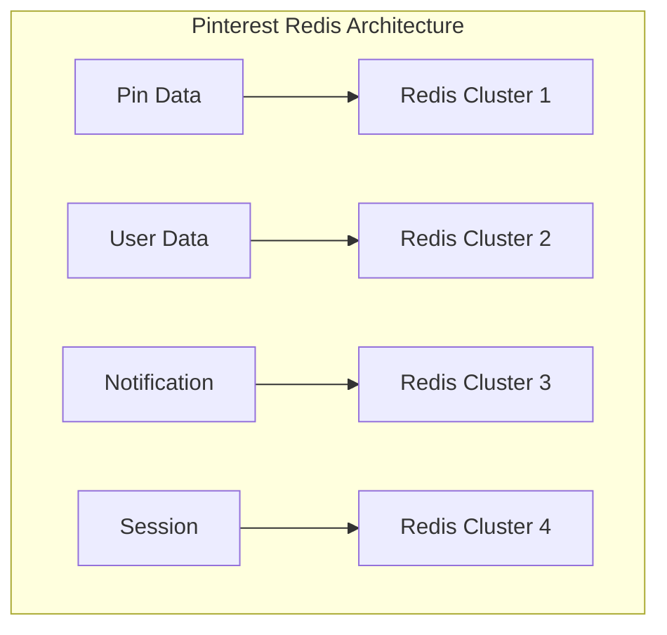
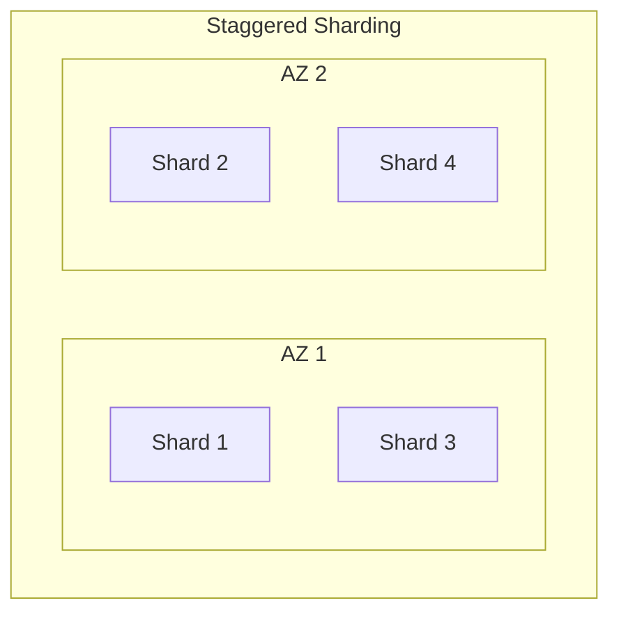

# Production Patterns

대규모 서비스 기업들의 실제 운영 사례입니다.

---

## Linux Kernel Tuning for Redis

> 프로덕션 환경 커널 튜닝

### 개요

기본 Linux 커널 설정은 인메모리 데이터베이스에 적합하지 않습니다. Redis를 프로덕션에서 운영할 때는 다음 설정을 조정해야 합니다.

### 메모리 관련 설정

#### vm.overcommit_memory

```bash
# /etc/sysctl.conf
vm.overcommit_memory = 1
```

- **0 (기본값)**: 커널이 메모리 오버커밋 여부 결정
- **1**: 항상 오버커밋 허용 (Redis 권장)
- **2**: 오버커밋 금지

Redis는 포크(Fork) 시 메모리를 복제하므로 오버커밋이 필요합니다.

#### Transparent Huge Pages (THP)

```bash
# THP 비활성화
echo never > /sys/kernel/mm/transparent_hugepage/enabled
```

THP는 Redis의 지연 시간에 큰 영향을 미칠 수 있습니다.

### 네트워크 설정

#### TCP 백로그

```bash
# /etc/sysctl.conf
net.core.somaxconn = 65535
net.ipv4.tcp_max_syn_backlog = 65535
```

Redis의 `tcp-backlog` 설정과 함께 조정해야 합니다.

#### TCP Keepalive

```bash
net.ipv4.tcp_keepalive_time = 300
net.ipv4.tcp_keepalive_intvl = 30
net.ipv4.tcp_keepalive_probes = 3
```

### 파일 디스크립터

```bash
# /etc/security/limits.conf
redis soft nofile 65535
redis hard nofile 65535
```

### 스와핑 방지

```bash
# 스와핑 최소화
vm.swappiness = 1
```

완전히 비활성화(swappiness=0)보다 1로 설정하는 것이 안전합니다.

### Redis 설정 연동

```redis
# redis.conf
tcp-backlog 511
maxmemory-policy noeviction
```

---

## Pinterest: Task Queue and Functional Partitioning

> 태스크 큐 및 기능 분할 패턴

### 개요

Pinterest는 1개 인스턴스에서 1000개 이상으로 Redis를 수평 확장한 사례입니다.

### 기능 분할 (Functional Partitioning)



용도별로 별도의 Redis 클러스터를 운영:
- **Pin 데이터**: 핀 메타데이터 및 카운트
- **사용자 데이터**: 사용자 프로필 및 관계
- **알림**: 알림 큐 및 상태
- **세션**: 사용자 세션

### List 기반 신뢰성 있는 큐

```redis
# 작업 큐잉
LPUSH task:queue:high "{...task...}"

# 작업 소비 (처리 리스트로 이동)
RPOPLPUSH task:queue:high task:processing

# 작업 완료 후 제거
LREM task:processing 1 "{...task...}"
```

### 수평 확장 전략

1. **샤딩**: 클라이언트 사이드 샤딩으로 데이터 분산
2. **기능 분할**: 용도별 독립적인 클러스터
3. **계층화**: 핫/콜드 데이터 분리

### 교훈

- 단일 인스턴스에서 시작하여 필요에 따라 확장
- 기능별 분리로 장애 격리
- 신뢰성 있는 큐 패턴으로 작업 처리

---

## Twitter/X: Deep Internals and Custom Data Structures

> 커스텀 데이터 구조 사례

### 개요

Twitter는 Redis를 대규모로 사용하면서 다양한 커스터마이징을 수행했습니다. 이 중 많은 혁신이 이제 Redis 코어에 통합되었습니다.

### Quicklist

Twitter는 List의 메모리 효율성을 개선했습니다:

```redis
# 이제 Redis 코어에 통합됨
# 리스트는 내부적으로 quicklist 사용 (ziplist + linked list)
```

### 메모리 관리 개선

- **jemalloc**: 메모리 단편화 감소
- **Lazy Free**: 백그라운드에서 메모리 해제

### Timeline 패턴

```redis
# 사용자 타임라인 (List)
LPUSH timeline:user:123 "tweet:456"
LRANGE timeline:user:123 0 49  # 최근 50개

# 팬아웃 최적화
# 인기 사용자는 Pull 모델
# 일반 사용자는 Push 모델
```

### 교훈

- 대규모에서는 기본 데이터 구조의 내부 구현 이해가 중요
- 메모리 최적화는 지속적인 과제
- 이제 많은 최적화가 Redis 코어에 포함됨

---

## Uber: Resilience Patterns and Staggered Sharding

> 복원력 패턴과 Staggered Sharding

### 개요

Uber는 초당 1억 5천만 작업의 캐시 워크로드를 처리합니다.

### Staggered Sharding



샤드를 여러 가용 영역에 교차 배치하여 동시 장애 방지:
- AZ 1 장애 시 AZ 2의 샤드가 서비스 유지
- 각 샤드의 복제본은 다른 AZ에 배치

### 서킷 브레이커

```python
# 의사코드
class CircuitBreaker:
    def __init__(self, failure_threshold=5, timeout=30):
        self.failures = 0
        self.state = "closed"

    def execute(self, operation):
        if self.state == "open":
            if time.time() - self.last_failure > self.timeout:
                self.state = "half-open"
            else:
                raise CircuitOpenException()

        try:
            result = operation()
            self.on_success()
            return result
        except Exception as e:
            self.on_failure()
            raise
```

### Graceful Degradation

```python
# 캐시 장애 시 폴백
def get_user(user_id):
    try:
        return cache.get(f"user:{user_id}")
    except CacheException:
        # 캐시 장애 시 DB 직접 조회
        return database.get_user(user_id)
```

### 주요 패턴

| 패턴 | 설명 |
|------|------|
| Staggered Sharding | AZ 교차 배치로 장애 격리 |
| Circuit Breaker | 연속 실패 시 자동 차단 |
| Graceful Degradation | 캐시 장애 시 폴백 |
| Bulkhead | 리소스 격리 |

### 교훈

- 대규모에서는 부분 장애가 일상적
- 다양한 복원력 패턴 조합 필요
- 캐시 장애에도 서비스 지속 가능하도록 설계
