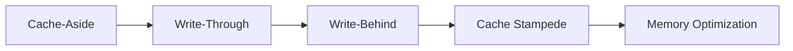
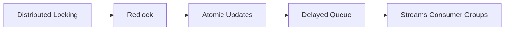
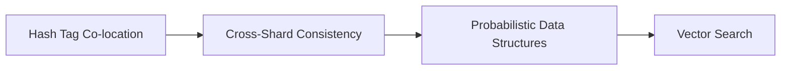

# Redis Design Patterns

> https://redis.antirez.com/ 문서를 기반으로 한 Redis 디자인 패턴 학습 노트

## 개요

이 문서는 Redis를 활용한 30개의 디자인 패턴을 체계적으로 정리한 것입니다. Redis 창시자인 Salvatore Sanfilippo(antirez)가 작성한 패턴들을 기반으로 하며, 실무 적용을 위한 명령어 예시와 사용 시나리오를 포함합니다.

> **중요**: 이 문서는 Redis(redis.io)에 특화되어 있습니다. Valkey, KeyDB, Dragonfly 등 Redis 호환 데이터베이스에서는 구현이 다를 수 있으므로 호환성을 확인해야 합니다.

## 패턴 분류

### 1. Fundamental Design Patterns (20개)

핵심 아키텍처 패턴으로, Redis를 사용하는 모든 시스템에서 필수적으로 이해해야 하는 패턴들입니다.

#### 캐싱 패턴
- [Cache-Aside Pattern](01-Caching_Patterns.html#cache-aside-pattern-lazy-loading) - 읽기 중심 워크로드를 위한 지연 로딩
- [Write-Through Caching](01-Caching_Patterns.html#write-through-caching-pattern) - 캐시-DB 강한 일관성 유지
- [Write-Behind Caching](01-Caching_Patterns.html#write-behind-write-back-caching-pattern) - 최대 쓰기 처리량을 위한 비동기 동기화
- [Cache Stampede Prevention](01-Caching_Patterns.html#cache-stampede-prevention) - 캐시 스탬피드(Thundering Herd) 방지
- [Server-Assisted Client-Side Caching](01-Caching_Patterns.html#server-assisted-client-side-caching) - 네트워크 RTT 제거

#### 동시성 제어
- [Distributed Locking](02-Distributed_Locking.html#distributed-locking-with-redis) - 분산 뮤추얼 익스클루전
- [Redlock Algorithm](02-Distributed_Locking.html#the-redlock-algorithm) - 장애 허용 분산 락
- [Atomic Update Patterns](02-Distributed_Locking.html#atomic-update-patterns) - WATCH/MULTI/EXEC, Lua 스크립트

#### 큐 및 메시지 처리
- [Delayed Queue Pattern](03-Queue_Patterns.html#delayed-queue-pattern) - Sorted Set을 활용한 지연 실행
- [Reliable Queue Pattern](03-Queue_Patterns.html#reliable-queue-pattern) - LMOVE를 활용한 신뢰성 있는 메시지 전달
- [Streams Consumer Group Patterns](03-Queue_Patterns.html#streams-consumer-group-patterns) - 소비자 그룹 기반 메시지 처리
- [Redis Streams and Event Sourcing](03-Queue_Patterns.html#redis-streams-and-event-sourcing) - 이벤트 소싱 구현

#### 데이터 구조 활용
- [Memory Optimization Patterns](04-Data_Structure_Patterns.html#memory-optimization-patterns) - 메모리 사용량 최적화
- [Probabilistic Data Structures](04-Data_Structure_Patterns.html#probabilistic-data-structures) - HyperLogLog, Bloom Filter 등
- [Rate Limiting Patterns](04-Data_Structure_Patterns.html#rate-limiting-patterns) - 분산 속도 제한
- [Lexicographic Sorted Set Patterns](04-Data_Structure_Patterns.html#lexicographic-sorted-set-patterns) - 문자열 인덱싱

#### 확장성 및 특수 용도
- [Hash Tag Co-location](05-Advanced_Patterns.html#hash-tag-co-location-patterns) - Redis Cluster에서 키 배치 제어
- [Cross-Shard Consistency](05-Advanced_Patterns.html#cross-shard-consistency-patterns) - 샤드 간 일관성 패턴
- [Vector Sets and Similarity Search](05-Advanced_Patterns.html#vector-sets-and-similarity-search) - Redis 8 벡터 검색
- [Redis as a Primary Database](05-Advanced_Patterns.html#redis-as-a-primary-database) - Redis를 주 데이터베이스로 사용

### 2. Community Patterns (6개)

Redis 커뮤니티에서 개발한 일반적인 사용 사례 패턴입니다.

- [Bitmap Patterns](06-Community_Patterns.html#bitmap-patterns) - 수백만 개의 불린 플래그 저장
- [Geospatial Patterns](06-Community_Patterns.html#geospatial-patterns) - 위치 기반 쿼리
- [Leaderboard Patterns](06-Community_Patterns.html#leaderboard-patterns) - 실시간 랭킹 시스템
- [Pub/Sub Patterns](06-Community_Patterns.html#pubsub-patterns) - 실시간 이벤트 브로드캐스트
- [Session Management Patterns](06-Community_Patterns.html#session-management-patterns) - 세션 저장소
- [Vector Search and AI Patterns](06-Community_Patterns.html#vector-search-and-ai-patterns) - AI/ML 인프라

### 3. Production Patterns (4개)

대규모 서비스 기업들의 실제 운영 사례입니다.

- [Linux Kernel Tuning](07-Production_Patterns.html#linux-kernel-tuning-for-redis) - 프로덕션 환경 커널 튜닝
- [Pinterest](07-Production_Patterns.html#pinterest-task-queue-and-functional-partitioning) - 태스크 큐 및 기능 분할
- [Twitter/X](07-Production_Patterns.html#twitterx-deep-internals) - 커스텀 데이터 구조
- [Uber](07-Production_Patterns.html#uber-resilience-patterns-and-staggered-sharding) - 복원력 패턴

## 학습 로드맵

### Phase 1: 기초 패턴 (1-2주차)
캐싱과 기본 데이터 구조 이해

### Phase 2: 분산 시스템 패턴 (3-4주차)
동시성 제어와 큐 처리

### Phase 3: 고급 패턴 (5-6주차)
확장성과 특수 용도

### Phase 4: 실무 적용 (7주차 이후)
커뮤니티 패턴과 프로덕션 사례 학습

## 빠른 참조

### 캐싱 패턴 선택 가이드

| 사용 사례 | 패턴 | 주요 명령어 |
|----------|------|------------|
| 읽기 중심, 약간의 오래된 데이터 허용 | Cache-Aside | GET, SETEX |
| 강한 일관성 필요 | Write-Through | SET, GET |
| 높은 쓰기 처리량 | Write-Behind | SET, async sync |
| 인기 키, 초고속 액세스 | Client-Side Cache | CLIENT TRACKING |

### 큐 패턴 선택 가이드

| 사용 사례 | 패턴 | 주요 명령어 |
|----------|------|------------|
| 단순 FIFO | List | LPUSH, RPOP |
| 신뢰성 있는 전달 | LMOVE | LMOVE, LREM |
| 지연 실행 | Sorted Set | ZADD, ZRANGEBYSCORE |
| 다중 소비자 | Streams | XADD, XREADGROUP, XACK |

### 카운팅/분석 구조 선택

| 사용 사례 | 구조 | 메모리 |
|----------|------|--------|
| 정확한 유니크 카운트 | Set | O(N) |
| 근사 유니크 | HyperLogLog | 12KB 고정 |
| 멤버십 테스트 | Bloom Filter | 설정 가능 |
| 백분위수 | T-Digest | 설정 가능 |

## 참고 자료

- [Redis 공식 문서](https://redis.io/docs/)
- [Redis 소스 코드](https://github.com/redis/redis)
- [Redis Design Patterns (원본)](https://redis.antirez.com/)
